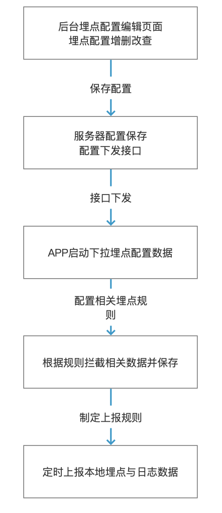

健康界 iOS端埋点技术文档 

目前健康界APP依赖于纯手工埋点，这种方案的好处是，用起来比较简单，在收集个性化数据时也比较灵活。但是也有一些问题，比如：

+ 新增埋点依赖App发版，影响数据收集时机。
+ App发版需要埋点工作完成，影响版本进度。
+ 埋点代码和业务代码耦合在一起，增加代码维护难度。

由于以前埋点方案处于纯手工阶段，而且新增埋点依赖于发版，特总结此版本技术文档，供同事领导参阅，优化埋点方案使之可以服务器可控制70%的埋点。也为日后公司产生可视化埋点工具做下准备工作。

整体概览的介绍分为2个部分：产品原型概览和技术原理概览。首先介绍产品原型概览，可以更直观了解可无痕埋点的基本运作流程。

产品原型概览 	

